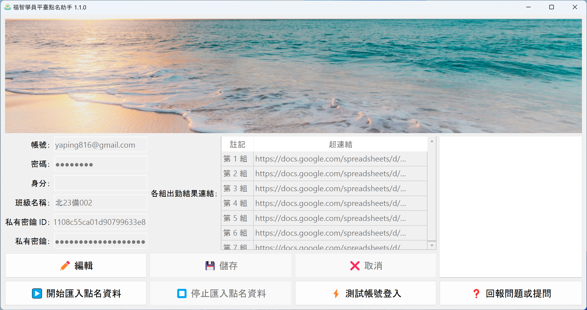

# 福智學員平臺點名助手



* [使用說明](#使用說明)
  + [下載](#下載)
  + [環境需求](#環境需求)
  + [執行](#執行)
* [Development](#development)
  + [Environment](#environment)
    - [Reference](#reference)
  + [Setup](#setup)
  + [Run](#run)
    - [福智學員平臺點名助手](#福智學員平臺點名助手-1)
    - [Qt Designer](#qt-designer)
  + [Packaging](#packaging)
    - [Desktop application](#desktop-application)
  + [Design concepts](#design-concepts)
  + [Key libraries](#key-libraries)
* [License](#license)

## 使用說明

### 下載

https://github.com/changyuheng/blisswisdom-roll-call-assistant/releases

### 環境需求

| 作業系統                                                                | 瀏覽器                                           |
| ----------------------------------------------------------------------- | ------------------------------------------------ |
| [Windows](https://www.microsoft.com/windows/)                           | [Microsoft Edge](https://www.microsoft.com/edge) |
| [macOS](https://www.apple.com/macos/)                                   | [Google Chrome](https://www.google.com/chrome/)  |
| [Linux distributions](https://en.wikipedia.org/wiki/Linux_distribution) | [Google Chrome](https://www.google.com/chrome/)  |

### 執行

`福智學員平臺點名助手.exe`

## Development

### Environment

1. [Python](https://www.python.org/) 3.10
2. [Poetry](https://python-poetry.org/)
3. [PyCharm](https://www.jetbrains.com/pycharm/)
4. [Git](https://git-scm.com/)

#### Reference

[My Python Development Environment, 2020 Edition](https://jacobian.org/2019/nov/11/python-environment-2020/)

### Setup

```
poetry install
```

#### Windows Only

```
poetry run pip install numpy --upgrade  # EasyOCR depends on an older version of numpy, which is not compatible with our development environment.
```

### Run

#### 福智學員平臺點名助手

```
poetry run blisswisdom-roll-call-assistant-desktop
```

#### Qt Designer

```
poetry run pyside6-designer
```

### Packaging

#### Desktop application

```
poetry run pyinstaller --clean desktop.spec
```

### Design concepts

1. [Object-oriented programming](https://en.wikipedia.org/wiki/Object-oriented_programming) (OOP)
2. [Model–view–viewmodel](https://en.wikipedia.org/wiki/Model%E2%80%93view%E2%80%93viewmodel) (MVVM)

### Key libraries

1. [Qt for Python](https://www.qt.io/qt-for-python)
2. [Selenium](https://www.selenium.dev/)
3. [EasyOCR](https://github.com/JaidedAI/EasyOCR)

## License

[Mozilla Public License Version 2.0](https://www.mozilla.org/en-US/MPL/2.0/)
