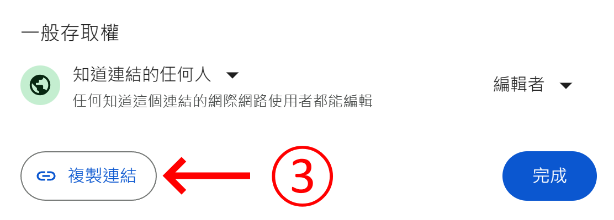

# 福智學員平臺點名助手

https://user-images.githubusercontent.com/1842626/232291434-848dc53c-09f3-42cd-9ce0-c32c05abe142.mp4

* [點名助手使用說明](#點名助手使用說明)
  + [下載](#下載)
  + [作業系統及瀏覽器需求](#作業系統及瀏覽器需求)
  + [執行方式](#執行方式)
  + [設定](#設定)
* [點名文件設置及操作流程說明](#點名文件設置及操作流程說明)
* [Development](#development)
  + [Environment](#environment)
    - [Reference](#reference)
  + [Setup](#setup)
  + [Run](#run)
    - [福智學員平臺點名助手](#福智學員平臺點名助手-1)
    - [Qt Designer](#qt-designer)
  + [Packaging](#packaging)
    - [Desktop application](#desktop-application)
  + [Design concepts](#design-concepts)
  + [Key libraries](#key-libraries)
* [License](#license)

## 點名助手使用說明

### 下載

請至[下載頁面](https://github.com/blisswisdom-students/blisswisdom-roll-call-assistant/releases)中下載版本號最大的版本，Windows 用戶請下載含有 Windows 字樣的 `zip` 檔，macOS 用戶請下載含有 Darwin 字樣的 `zip` 檔。

### 作業系統及瀏覽器需求

| 作業系統                                                                | 瀏覽器                                           |
| ----------------------------------------------------------------------- | ------------------------------------------------ |
| [Windows](https://www.microsoft.com/windows/)                           | [Microsoft Edge](https://www.microsoft.com/edge) |
| [macOS](https://www.apple.com/macos/)                                   | [Google Chrome](https://www.google.com/chrome/)  |
| [Linux distributions](https://en.wikipedia.org/wiki/Linux_distribution) | [Google Chrome](https://www.google.com/chrome/)  |

### 執行方式

| 作業系統                                                                | 執行檔名稱                 |
| ----------------------------------------------------------------------- | -------------------------- |
| [Windows](https://www.microsoft.com/windows/)                           | `福智學員平臺點名助手.exe` |
| [macOS](https://www.apple.com/macos/)                                   | `福智學員平臺點名助手`     |
| [Linux distributions](https://en.wikipedia.org/wiki/Linux_distribution) | `福智學員平臺點名助手`     |

### 設定


1. 在「帳號」、「密碼」處輸入登入帳號及密碼

   

2. 在「班級名稱」輸入福智學員平臺上對應的「班級名稱」

   

3. 在「超連結」欄位輸入各組「組員出席記錄」試算表的連結

   
   

## 點名文件設置及操作流程說明

1. [點名文件設置](docs/點名文件設置.md)
2. [點名流程](docs/點名流程.md)

## Development

### Environment

1. [Python](https://www.python.org/) 3.11
2. [Poetry](https://python-poetry.org/)
3. [PyCharm](https://www.jetbrains.com/pycharm/)
4. [Git](https://git-scm.com/)

#### Reference

[My Python Development Environment, 2020 Edition](https://jacobian.org/2019/nov/11/python-environment-2020/)

### Setup

```
poetry install
```

### Run

#### 福智學員平臺點名助手

```
poetry run blisswisdom-roll-call-assistant-desktop
```

#### Qt Designer

```
poetry run pyside6-designer
```

### Packaging

#### Desktop application

```
poetry run pyinstaller --clean desktop.spec
```

### Design concepts

1. [Object-oriented programming](https://en.wikipedia.org/wiki/Object-oriented_programming) (OOP)
2. [Model–view–viewmodel](https://en.wikipedia.org/wiki/Model%E2%80%93view%E2%80%93viewmodel) (MVVM)

### Key libraries

1. [Qt for Python](https://www.qt.io/qt-for-python)
2. [Selenium](https://www.selenium.dev/)

## License

[Mozilla Public License Version 2.0](https://www.mozilla.org/en-US/MPL/2.0/)
