# 點名文件設置

* [組員出席記錄試算表](#組員出席記錄試算表)
* [組員出席記錄試算表 Apps Script](#組員出席記錄試算表-Apps-Script)

## 組員出席記錄試算表

1. 組長或班幹部點擊「[組員出席紀錄範本](https://docs.google.com/spreadsheets/d/1WCO15Z-Kj2gNA60GBuSBslH1TpkYzbGNosrNJG49eKg/copy)」連結複製「組員出席紀錄範本」試算表到自己的 Google 帳號下：

   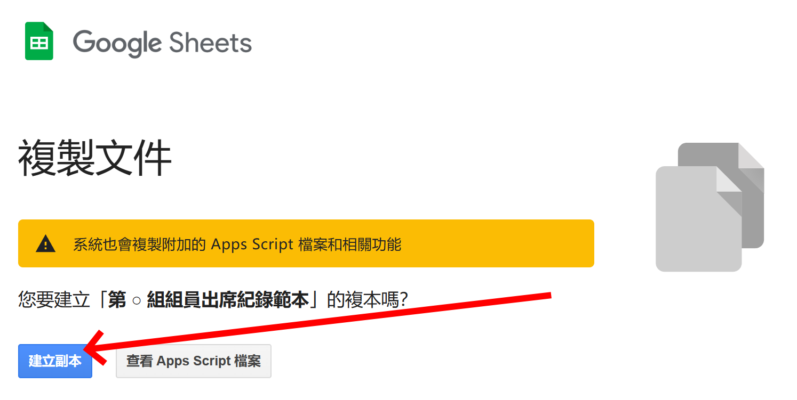

2. 複製後，可將試算表「檔名」改為自己想要的名稱：

   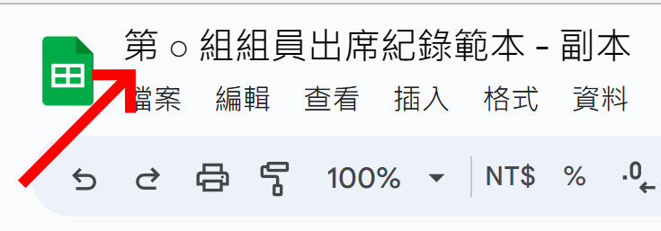

   例如「北 23 備 002 第 1 組組員出席記錄」：

   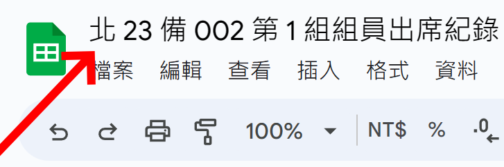

3. 開啟試算表，並填入正確的「組員名單」：

   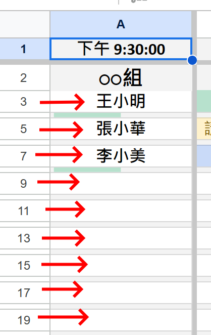

4. 在儲存格 `A1` 按下 `Ctrl` + `Shift` + `;` (Windows) 或 `⌘` + `Shift` + `;` (macOS) 輸入當前「時間」：

   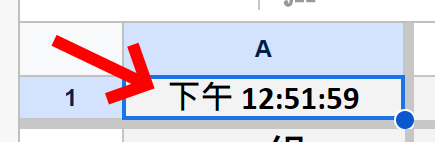

   接著將此「時間」手動修改為研討班的「下課」時間：

   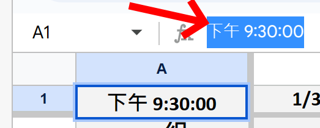

5. 在儲存格 `A2` 輸入組別編號，編號數字部分必須為「半形阿拉伯數字」：

   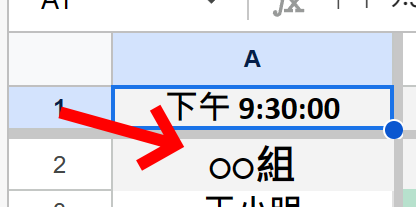

   也可以加入中文名稱以利識別：

   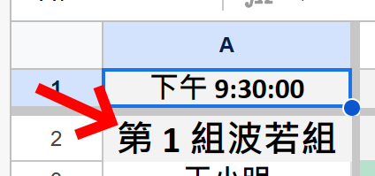

6. 在儲存格 `B1` 按下 `Ctrl` + `;` (Windows) 或 `⌘` + `;` (macOS) 輸入當前「日期」：

   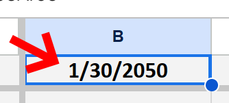

   接著將此「日期」手動修改為研討班的「上課日期」：

   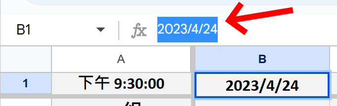

   注意：日期格式只能是「半形」的「西元年/月/日」或「月/日/西元年」其中之一。

7. 將 `B` 欄中的出席記錄範例：

   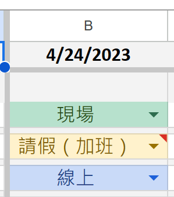

   清除：

   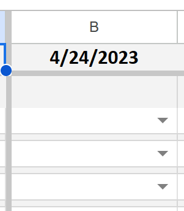

8. 將此組員出席記錄試算表權限設為「任何人皆可編輯」。點擊右上角的「共用」：

   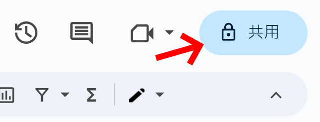

   接著把存取權限設定為「知道連結的任何人」：

   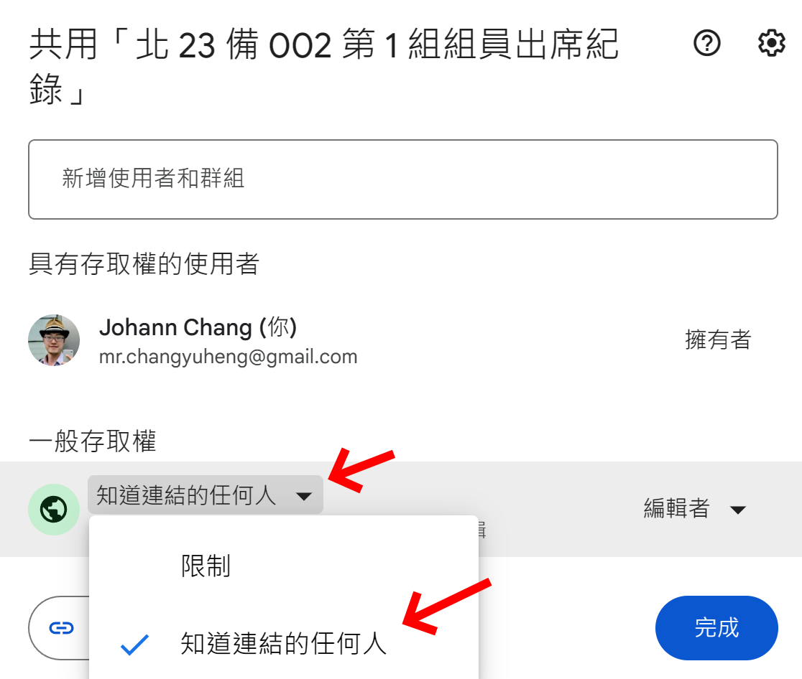

   及「編輯者」：

   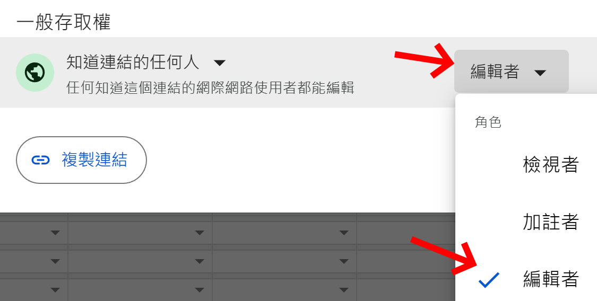

   然後點擊「完成」：

   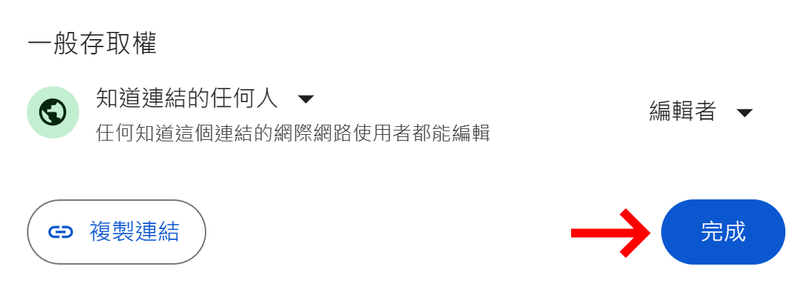

## 組員出席記錄試算表 Apps Script

1. 在「組員出席記錄」試算表中，由「擴充功能」開啟「Apps Script」：

   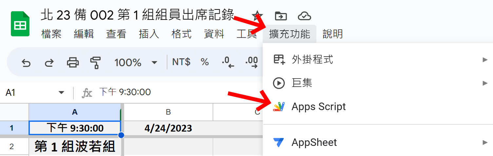

3. 可將 Apps Script 專案名稱「組員出席記錄試算表手稿」更改為適合的名稱：

   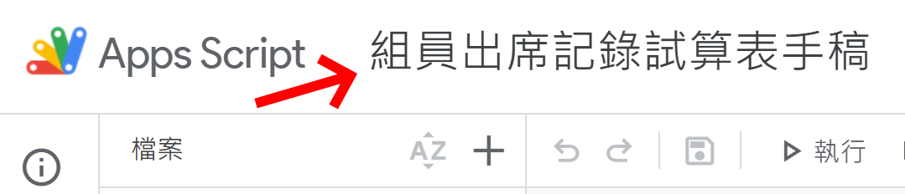

   如「北 23 備 002 第 1 組組員出席記錄試算表手稿」：

   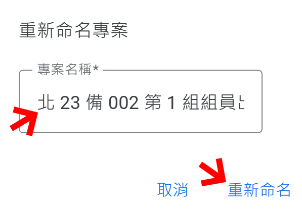

4. 取得「組員出席記錄」試算表的共用連結。點擊右上角的「共用」：

   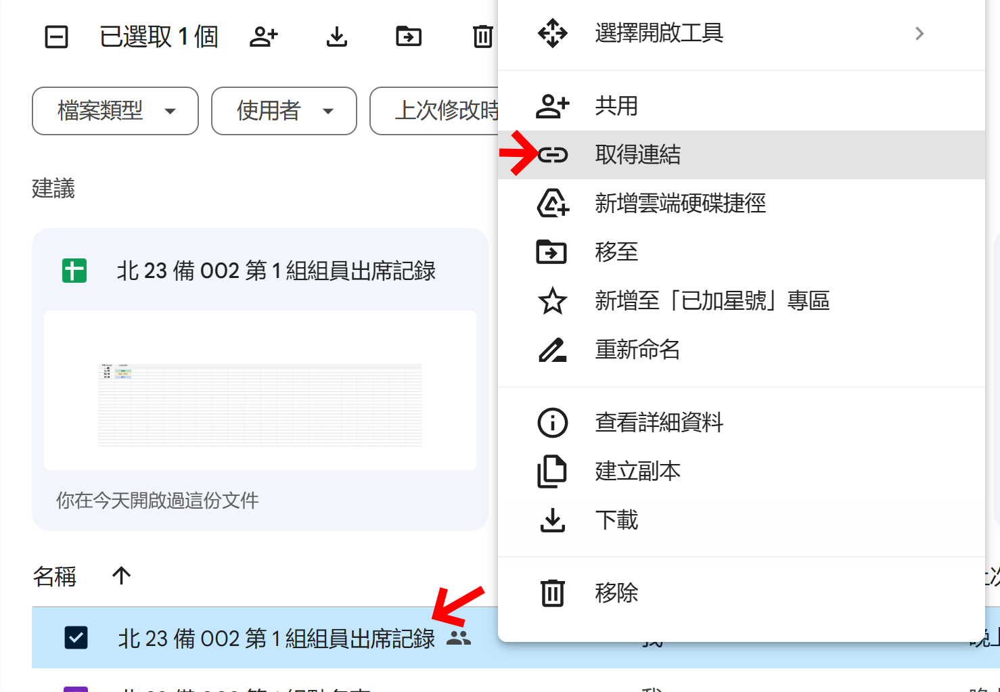

   點擊「複製連結」並點擊「完成」：

   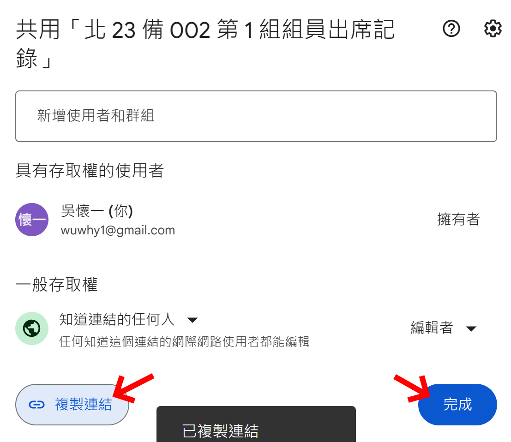

5. 回到 Apps Script 專案「組員出席記錄試算表手稿」，將第 1 行引號中的「組員出席記錄試算表 URL」：

   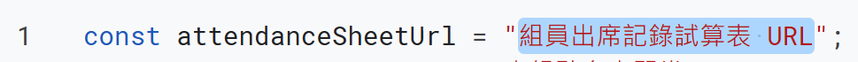

   更改為剛剛複製的連結：

   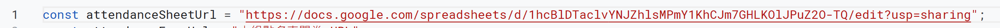

8. 在 Apps Script 編輯器中，點擊工具列上的「執行」：

   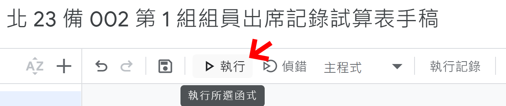

   在「需要授權」提示窗中點擊「審查權限」：

   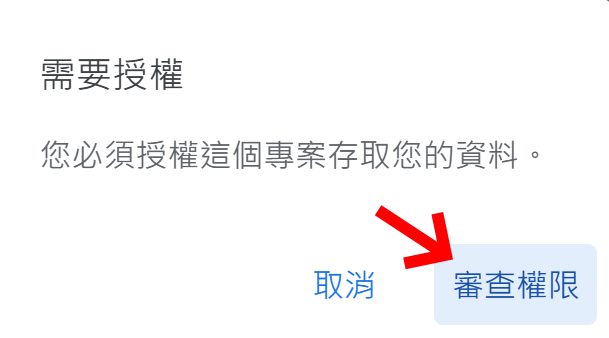

   選擇欲使用的 Google 帳戶，通常選自己的帳戶即可：

   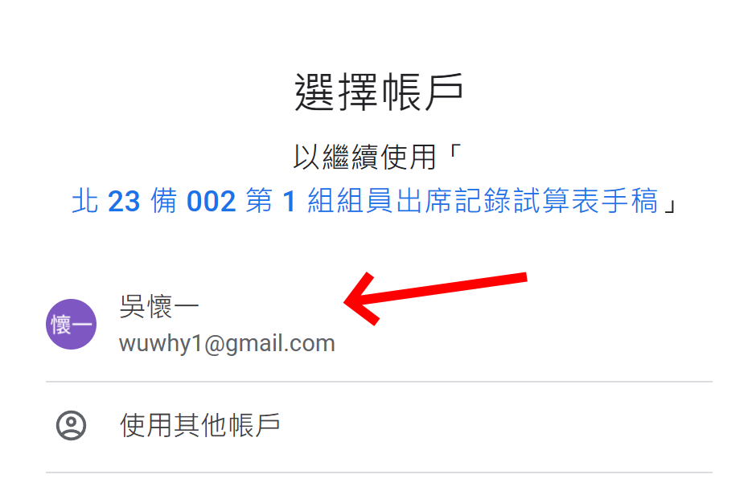

   在「這個應用程式未經 Google 驗證」提示窗中點擊「進階」：

   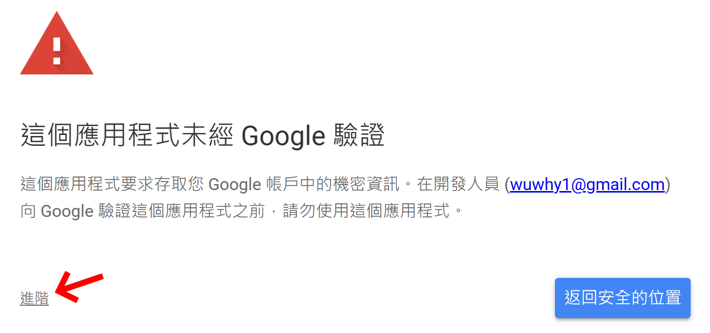

   再點擊『前往「……」(不安全)』：

   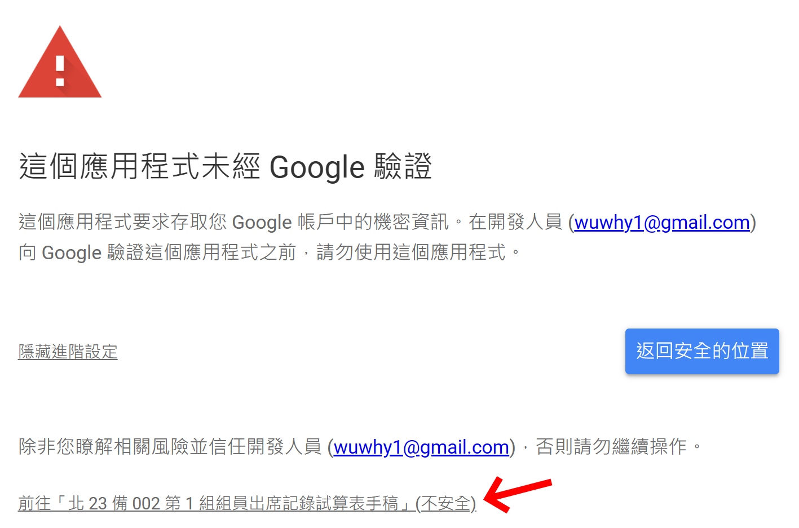

   在『「……」想要存取您的 Google 帳戶』提示窗中點擊「允許」：

   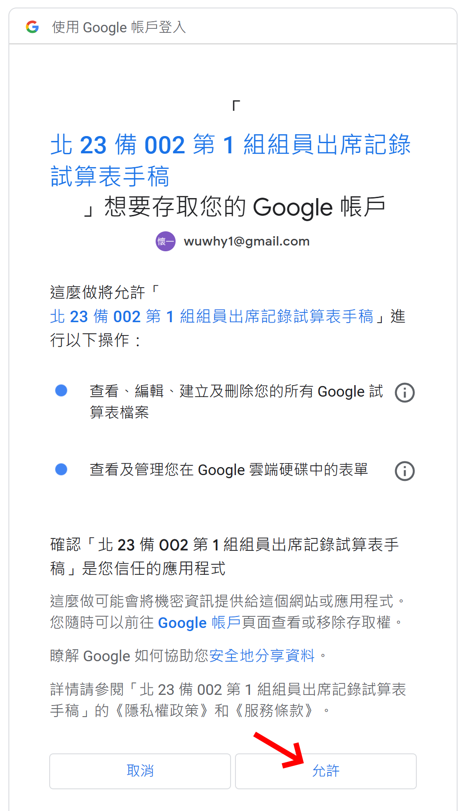

9. 點擊左側的「觸發條件」：

   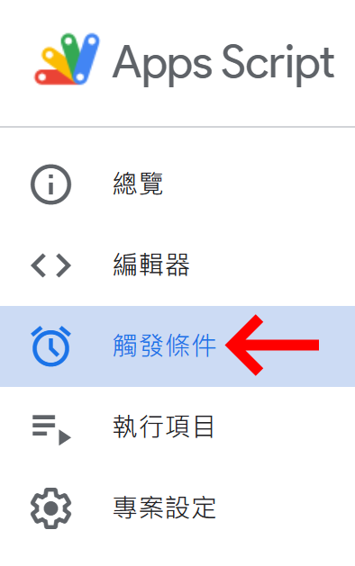

   點擊右下角的「新增觸發條件」：

   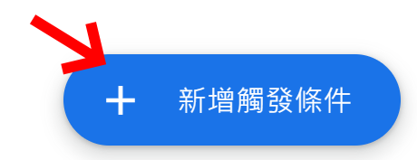

   在觸發條件設定窗中，將「選取活動來源」設定為「時間驅動」：

   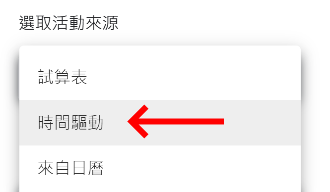

   將「選取時間型觸發條件類型」設定為「分鐘計時器」、「選取分鐘間隔」設定為「每分鐘」：

   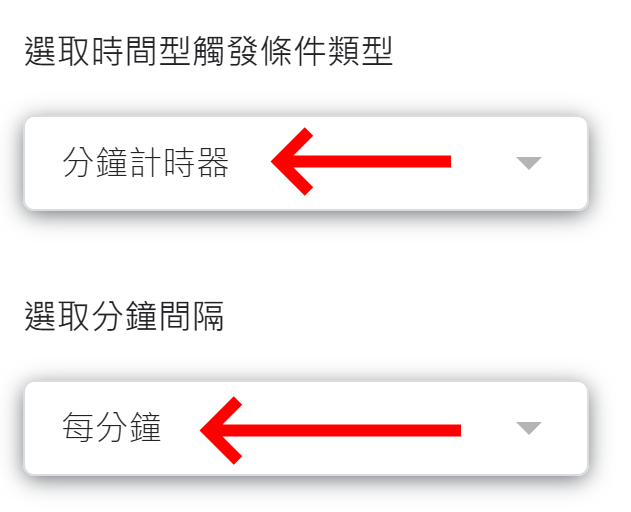

   最後點擊「儲存」：

   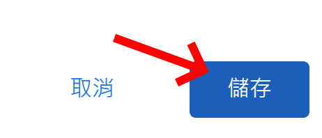
