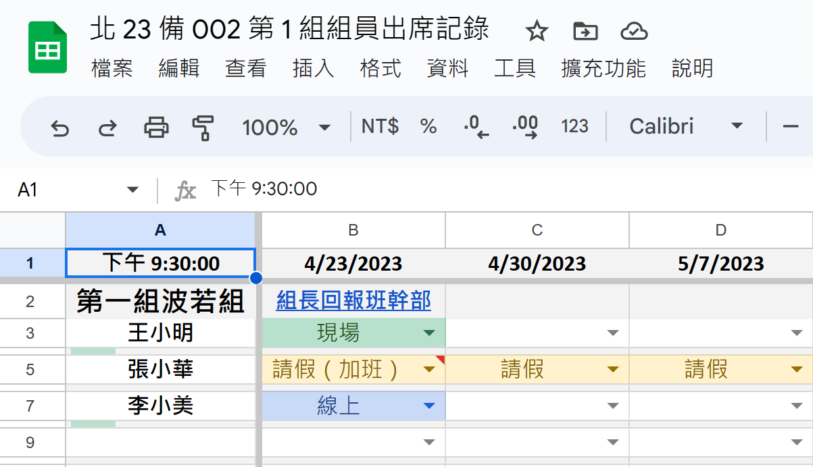
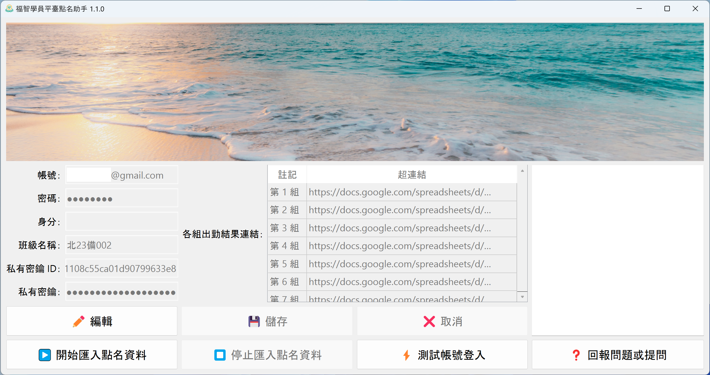

# 點名流程

1. [手機、電腦皆可操作] 以「組員出席記錄」試算表記錄組內出席狀況

   

   1. 組長或班幹部在「組員出席記錄」試算表第 1 列輸入上課日期，並透過下列其中一個方案登記組員出席狀況：

      1. 各組員自行至「組員出席記錄」試算表登記自己的出席狀況
      2. 由組長或班幹部統一記錄該組的出席狀況

   2. 組長或班幹部可提早填入預定上課日期，供需請假的組員預先填寫。

   3. 若由組員自行登記出席狀況，則最遲需在下課前完成當下課堂的出席登記，下課後（下課時間設定在 `A1` 儲存格），過去課堂的出席欄位會被自動鎖定，組員將無法再做修改。此時若需修改，需請有該出席記錄試算表「編輯權限」的人員幫忙，如組長或班幹部。

   4. 組長或班幹部亦可設定讓其他人員具備「編輯權限」，藉以分工。

2. [僅能在電腦操作] 匯整各組「組員出席記錄」試算表後，使用「點名助手」匯入「福智學員平臺」

   

   待各組點名作業完成後，班幹部點擊「點名助手」中的「開始匯入點名資料」，即可將各組出席狀況自「組員出席記錄」試算表「一鍵」匯入至「福智學員平臺」。
