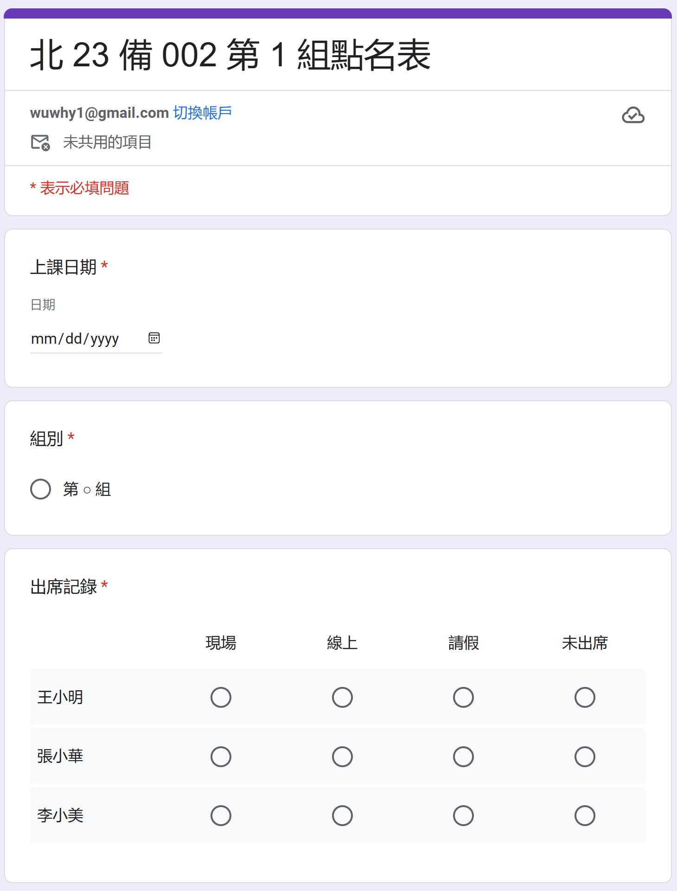

1. [手機、電腦皆可操作] 組長在「組員出席記錄」試算表第 1 列新增上課日期，並請各組員自行至「組員出席記錄」試算表登記各自的出席狀況。組長可提早填入多個預定上課日期，供組員提早請假。組員最遲需在下課前完成當下課堂的出席登記，下課後，過去課堂的出席欄位會被自動鎖定，組員無法再做修改。此時若需修改，需請有該出記錄試算表編輯權限的人員幫忙，如組長。

   

   P.S: 組長也可以用其他方式點名，只要記得下課後填寫「小組點名表」問卷即可。

2. [手機、電腦皆可操作] 下課後，組長至「組員出席記錄」試算表點擊對應當次課堂的「組長回報班幹部」連結，回報整組出席狀況至「小組點名表」問卷。若試算表在「組長回報班幹部」連結產生後，已鎖定的欄位有更動，請在更動後，將對應的「組長回報幹部」欄位中的內容清除，等待約 1 分鐘該欄位內的連結即會被重新產生。產生後，組長即可透過點選更新後的連結將組員出席記錄填寫到「小組點名表」問卷送交班幹部。

   

   P.S: 若組長不是透過「組員出席記錄」試算表點名，就無法使用「組長回報班幹部」連結將出席狀況自動帶入點名表問卷。此情形請組長自行填寫「小組點名表」問卷。

3. [僅能在電腦操作] 待所有組別都送交「小組點名表」後，班幹部點擊「點名助手」中的「開始匯入點名資料」，將各組出席狀況匯入至「福智學員平臺」。

   
